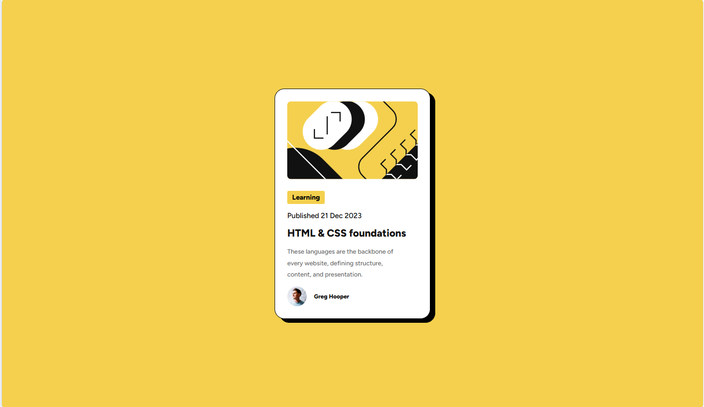

# Frontend Mentor - Blog preview card solution

This is a solution to the [Blog preview card challenge on Frontend Mentor](https://www.frontendmentor.io/challenges/blog-preview-card-ckPaj01IcS).
## Table of contents

- [Overview](#overview)
  - [The challenge](#the-challenge)
  - [Screenshot](#screenshot)
  - [Links](#links)
- [My process](#my-process)
  - [Built with](#built-with)
  - [What I learned](#what-i-learned)
  - [Continued development](#continued-development)
  - [AI Collaboration](#ai-collaboration)

## Overview

### The challenge

Users should be able to:

- See hover and focus states for all interactive elements on the page

### Screenshot




### Links

- Solution URL: [Add solution URL here](https://github.com/HAGRGHARIB/blog-preview-card-main.git)
- Live Site URL: [Add live site URL here](https://hagrgharib.github.io/blog-preview-card-main/)

## My process

### Built with

- Semantic HTML5 markup
- Flexbox
- External Style
- Desktop-first workflow

### What I learned

This project helped me improve my CSS, HTML, and overall attention to detail.

I learned how to use box-shadow instead of trying to create a shadow using a pseudo-element like ::after.
```css
.card {
  box-shadow: 5px 5px 0 black;
}
```

I started using semantic HTML more carefully than before. I now understand better when to use elements such as <main>, <time>, headings, and paragraphs. I still have a lot to learn about semantic HTML, but I feel that I am improving.

I started paying more attention to the small differences between my implementation and the original design. Some differences were very small, and I didn't notice them at first. This project taught me to compare my result with the design more carefully.

I improved the way I name my CSS classes. I started thinking more about what each element represents and using more consistent naming instead of choosing class names randomly.

### Continued development

- Semantic HTML5 markup
- CSS custom properties
- Mobile-first workflow


### AI Collaboration

AI Tools Used

I used ChatGPT during this project mainly as a learning and debugging assistant.

Debugging: I used ChatGPT to help me understand why some CSS properties were not working as expected and to identify possible issues in my code.

Learning: I asked for explanations of CSS concepts such as box-shadow, pseudo-elements, CSS custom properties, semantic HTML, and BEM class naming.

Guidance: I used it to review my approach and understand better solutions rather than copying a complete implementation.

What worked well?
ChatGPT was especially helpful when I was stuck with a specific problem. The explanations helped me understand why something was happening, which made it easier for me to fix the code myself.

What didn't work?
Sometimes AI suggestions can provide a solution too quickly without giving me enough opportunity to figure it out myself. I found it more useful to ask for hints and explanations instead of complete solutions, so I could understand and implement the solution on my own.


